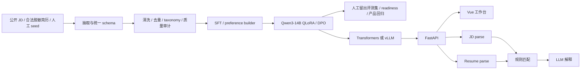

# 产品与技术审查（2026-08-09）

> 2026-08-12 更正：后续审计确认旧 Match 评测实际只有 16 个基础样例及其格式变体，且相同基础样例曾进入匹配训练池。本文关于 Match “人工留出评测集”的表述只代表当时设计意图，相关历史分数不能作为独立泛化证据。当前状态和替代门禁见[人岗匹配持续质量目标](人岗匹配持续质量目标.md)。

## 结论

JobMatchTune 最有价值的部分不是“用了 Qwen3-14B”，而是围绕中文招聘文本建立了采集、清洗、弱标注、SFT/DPO、人工留出评测集、隐私/泄漏门禁、adapter 晋级和应用演示的完整实验闭环。相比常见的简历匹配 demo，它的数据工程和训练治理更完整。

但仓库当前把三种东西放在了同一个主平面：

1. 面向研究者的数据/训练平台；
2. 面向个人用户的简历匹配工作台；
3. 大量一次性官网探测和阶段性实验记录。

这导致“功能很多，产品边界不清”。当前应把它定义为实验工作台，而不是生产 ATS。下一阶段的重点应从扩模块转为评测可信度、隐私安全、低成本匹配和工程可复现。

## 产品定位

### 主要用户

- 第一用户：需要验证中文招聘结构化抽取和后训练方案的模型/数据工程人员。
- 第二用户：希望理解个人简历与目标 JD 差距、并获得有证据建议的求职者。

### 核心问题

输入的 JD 和简历是半结构化、格式不稳定且包含敏感信息。系统要解决的不是自由问答，而是：

- 把两侧文本转为稳定 schema；
- 把硬门槛、技能差距和方向差异以可解释方式算出来；
- 只基于证据生成建议；
- 用独立评测证明新模型没有让任一路任务回退。

### 非目标

- 不代替招聘人员做录用决策。
- 不声称匹配分数是候选人能力或就业概率。
- 不在当前阶段扩成职位发布、候选人管道、多租户权限齐全的 ATS。
- 不把 crawler 数量、合成样本数量或单次模型指标当作主要产品成功指标。

## 当前实现

### 数据层

- 官网 crawler 和公开导出 importer 把不同来源统一写入 JSONL/SQLite。
- `preprocess` 负责文本清洗、段落切分、近重复去重、岗位方向和技能规则。
- `dataset` 中存在多条 JD quality/strict/bootstrap、resume、match 和 preference builder。
- `eval` 同时承担人工集构造、字段级指标、数据画像、泄漏/隐私门禁和 adapter 回归比较。

优点是每个阶段有明确产物；缺点是 candidate、review、train pool 和 gold 曾全部放进 `data/eval/`，语义混乱。本轮已只保留版本化人工数据，并忽略可重建 pool。

### 训练层

- SFT 使用 Transformers、PEFT、TRL 和 4-bit QLoRA。
- DPO 可从现有 adapter 继续训练。
- 训练前运行 readiness gate；训练目录写 `run_manifest.json`。
- 晋级同时要求绝对产品阈值和相对基线无显著回退。

这是项目最成熟的工程设计。主要缺口是依赖没有 lock、manifest 未记录完整运行环境、模型/数据报告位于忽略目录而 README 曾引用本机绝对路径，外部使用者无法独立复核“当前默认版本”的指标。

### 推理与匹配层

- Transformers 后端进程内加载模型，使用互斥锁保护生成。
- vLLM 后端通过 OpenAI-compatible client 请求 JSON Schema structured output。
- Transformers 输出只做 JSON 修复和启发式字段归一化，没有按任务做最终 Pydantic 响应校验。
- 一次匹配顺序执行 JD parse、resume parse、规则评分、match explanation，共三次模型生成。
- 规则分数为方向 20、技能 45、学历 10、经验 15、项目 10；技能此前只做字符串相等。

本轮修复了两个会改变业务结论的缺陷：中文数字年限（如“三年”）此前被当作 0 年；resume 技能别名此前没有与 JD 使用同一 taxonomy，导致 `Golang/Go`、`SpringBoot/Spring Boot` 误判。

### API 与前端

API 已覆盖文本、文件、混合输入和批量任务，前端也能展示结构化结果和下载报告，作为实验 demo 是完整的。生产差距包括：

- `api/server.py` 集配置、模型生命周期、文件抽取、业务编排和路由于一体；
- batch 是 Python 顺序循环，不是真批处理；
- 文件使用带 10 MiB 默认上限的读取，但还没有 MIME/内容验证或文档沙箱；
- 无认证、限流和统一响应 contract；本轮才将默认 CORS 从 `*` 收紧到本机来源；
- status 暴露本地模型/adapter 路径；
- 前端从 unpkg 加载 Vue，没有依赖锁、构建或浏览器 E2E。

## 同类开源项目对照

| 项目 | 值得借鉴 | 本项目应避免照搬 |
| --- | --- | --- |
| [Resume Matcher](https://github.com/srbhr/resume-matcher) | 产品旅程聚焦“主简历 → JD → 建议 → 编辑/导出”；本地/云模型 provider 抽象；单端口容器、版本化镜像、持久化 | 不必立即复制完整编辑器、模板、求职信和面试生成，先证明中文匹配质量 |
| [OpenResume](https://github.com/xitanggg/open-resume) | PDF.js + 确定性解析，处理尽量本地化；解析器和 builder 边界清楚 | 它以简历制作/ATS 可读性为主，不覆盖本项目的数据与后训练治理 |
| [ESCO Skill Extractor](https://github.com/KonstantinosPetrakis/esco-skill-extractor) | taxonomy 对齐后使用 embedding 和阈值匹配技能/职业，适合补足纯字符串 overlap | ESCO 对中文岗位和国内技术别名覆盖不足，需要中文 taxonomy 与人工校准 |
| [Sentence Transformers](https://github.com/huggingface/sentence-transformers) | 提供语义相似度方案，可在字符串匹配确实不足时参考 | 未经人工留出评测集验证，不应直接把通用 embedding cosine 当作“匹配分” |
| [Reqcore](https://github.com/reqcore-inc/reqcore) | 评分明细可见、文档私有访问、限流、数据保留/导出/删除从产品层设计 | 多租户 ATS、职位管道和组织权限远超当前已验证需求 |

对照后的关键判断：本项目不需要变成另一个通用 Resume Matcher；应保留中文数据和后训练优势，先把当前“确定性规则评分 + 可选模型解释”做稳定。语义匹配只有在人工评测证明现有技能匹配不足时再考虑。

## 过度设计

### 1. 数据管道分支过多

JD 存在 strict、strict plus、strict plus v2、quality、bootstrap、repairable、supplemental、weak structured 等多个 builder。每次实验增加新文件而没有退役旧分支，导致主线意图要靠文档和文件名猜测。

建议先明确唯一推荐的 builder 和配置，旧实验分支停止扩展。当前不需要为了合并文件再设计新的 builder 框架。

### 2. 一对一 shell wrapper 过多

仓库约有 97 个脚本，其中大量文件只有 `cd` 加 `python -m ... "$@"`。它们没有增加抽象，只扩大文档和维护表面积。

当前不需要再设计一套复杂 CLI。只删除无人使用的 wrapper，并让 README 只推荐少数主入口；稳定的五行 wrapper 不必为了形式统一全部重写。

### 3. 所有能力共用一个重量级安装面

抓取、OCR、训练、API、GPU 量化和测试都在默认依赖中。只运行数据审计也会安装 torch、bitsandbytes、OCR 和服务依赖。

当前先维持一套安装方式，避免新增多组安装组合。`requirements.txt` 已改为引用 `pyproject.toml`，消除了两份依赖清单漂移；只有安装体积真正阻碍使用时再拆依赖组。

### 4. 大模型与规则双重修补

prompt 很短，但 JSON 后处理、岗位方向规则和质量修正已形成第二套复杂模型。它能兜底，却也让“adapter 的真实贡献”难以解释；任何指标提升可能来自规则变化。

建议所有报告同时记录 `model_raw`、`normalized`、`rule_version` 三层指标，并把确定性抽取能解决的字段从生成任务中剥离。

### 5. 阶段性资产长期留在主线

根目录 AI 草稿、三份重复项目故事、旧 1.7B shell、失效研究脚本、派生训练池和真实个人简历曾同时存在。本轮已删除；历史结论由 dated docs 和 Git 保留。

## 设计不足与风险

### 高风险

1. 文件接口已有限额，但仍缺少类型验证和恶意文档防护。
2. API 默认只接受本机来源，但仍无认证和限流，不适合含 PII 的公网服务。
3. 规则分数没有版本字段或校准证据，阈值 `45/65/85` 属于经验设定。
4. 小型人工留出评测集与大量合成/模板训练池之间存在代表性差距。
5. 无许可证；代码可见不等于可授权复用。

### 中风险

1. JSON 成功只代表 `json.loads` 成功，不代表命中正确任务 schema。
2. vLLM 与 Transformers 路径的 structured output 保障不一致。
3. batch 没有真正利用后端吞吐；Transformers 单锁限制并发。
4. crawler/probe 依赖外部未承诺 API，缺少 contract fixture 和失败隔离。
5. 没有 CI、lock、容器和正式 release，复现依赖本机环境。

### 低风险但持续增加维护成本

1. 中文字段名直接贯穿模型、规则、API 和前端，内部重构成本较高。
2. frontend 使用运行时模板字符串和 CDN ESM，规模继续增长后会失去类型与构建检查。
3. 许多测试验证 builder 细节，但缺少 API contract、恶意上传、并发和真实浏览器路径。

## 本轮已实施

- 修复中文经验年限和 resume 技能别名归一化。
- 修复/清除 Ruff 发现的真实 F/B 类问题，并把 lint 基线聚焦于错误而非一次性格式噪声。
- 所有当前训练/评测/数据脚本改为相对仓库路径，不再硬编码个人 home 和 conda 路径。
- 默认 CORS 从任意来源收紧到 localhost/127.0.0.1；外部来源必须显式配置。
- 上传读取增加 10 MiB 默认上限和回归测试，避免无界内存读取。
- 依赖元数据收口到 `pyproject.toml`。
- 删除旧 1.7B 入口、失效研究脚本、重复文档和根目录草稿。
- 删除真实个人简历 PDF 与其专用测试。
- 删除可重建的派生 candidate/train pool，并增加 Git ignore 规则。
- 重写 README、结构、路线图和本审查文档。

## 推荐执行顺序

1. 扩充三项核心任务的人工留出评测集，并补统一输出校验。
2. 先完善现有技能别名和评分规则；只有人工评测证明字符串匹配不足时，才试验语义匹配。
3. 让基础匹配分数无需等待模型解释，直接降低主流程延迟。
4. 补文件类型、安全错误和端到端示例。

暂不拆微服务、不建插件系统、不做完整 ATS，也不为统一形式大规模重写稳定模块。
